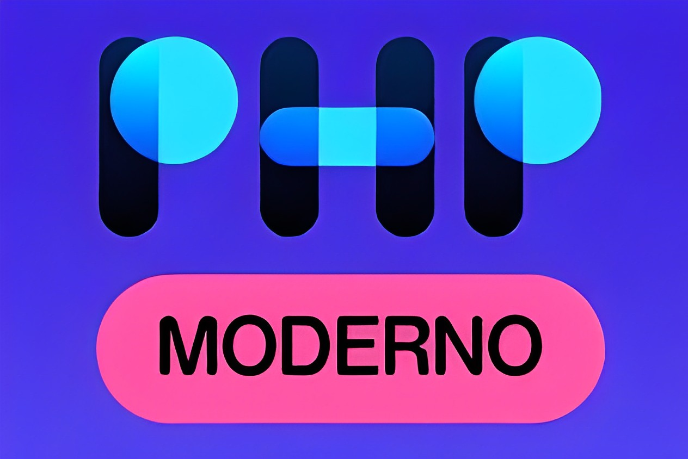

# Curso em Video - PHP Moderno

Material das aulas, exercícios e anotações do curso de PHP do Curso em Vídeo

---

### Curiosidades sobre o PHP

    
Por que um elefante?

    
De acordo com [Vincent]("https://www.instagram.com/vincentpontier/")

    
Significado da sigla

    <b>P</b>HP <b>H</b>ypertext <b>P</b>reprocessor

<!-- ## Anotações -->